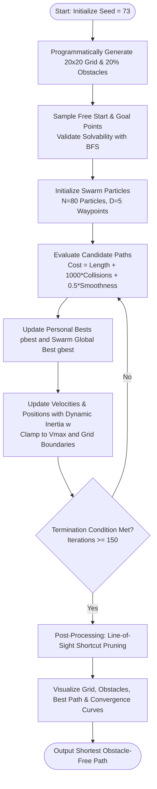
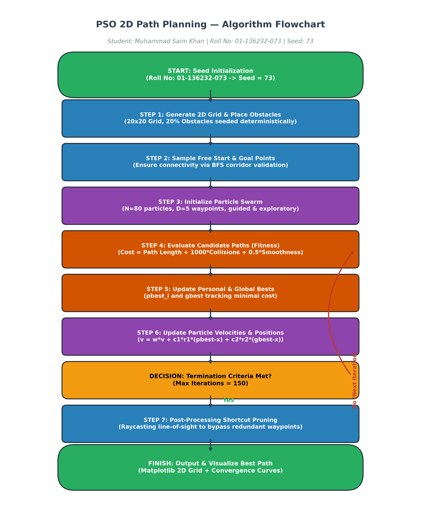
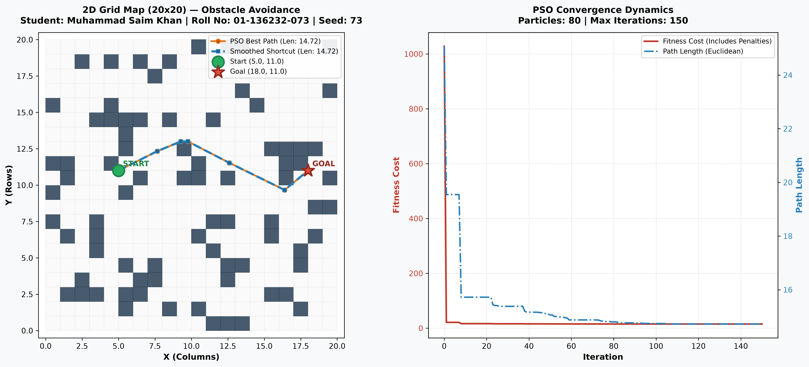

# Swarm-Based 2D Path Planning with Obstacles using PSO

**Course:** Swarm Intelligence (Semester 7) — Lab Assignment 1  
**Department:** BS-Artificial Intelligence - Department of Computer Science, Bahria University  

---

## Student & Problem Instance Information

| Attribute | Value |
| :--- | :--- |
| **Student Name** | **Muhammad Saim Khan** |
| **Roll Number** | **01-136232-073** |
| **Random Seed Used** | **`73`** (extracted directly from roll number ending ID) |
| **Grid Dimensions** | 20 &times; 20 (400 total cells) |
| **Obstacle Ratio** | 20.0% (80 blocked cells) |
| **Start Point $(X, Y)$** | **$(5.0, 11.0)$** |
| **Goal Point $(X, Y)$** | **$(18.0, 11.0)$** |
| **Euclidean Straight-Line Distance** | **13.00 units** |

> **Note on Problem Uniqueness:** In strict accordance with the assignment specifications, the grid environment, obstacle layout, and start/goal locations are generated purely programmatically using `random.seed(73)`. No coordinates or obstacles are hardcoded.

---

## 1. Approach & Methodology

This project formulates 2D robotic grid path planning as a continuous multi-dimensional optimization problem solved via **Particle Swarm Optimization (PSO)**.

### A. Candidate Path Representation
- A candidate path begins at fixed Start $S = (x_s, y_s)$ and terminates at Goal $G = (x_g, y_g)$.
- Each particle in the swarm encodes $D = 5$ intermediate waypoints:
  $$\mathbf{X}_i = \begin{bmatrix} (x_1, y_1), & (x_2, y_2), & \dots, & (x_D, y_D) \end{bmatrix} \in \mathbb{R}^{D \times 2}$$
- Complete candidate trajectory:
  $$P_i = [S, W_1, W_2, \dots, W_D, G]$$
- Continuous coordinates enable the swarm to explore smooth curves and diagonal corridors between obstacles rather than being constrained to rigid 4-directional grid steps.

### B. Fitness Evaluation & Collision Penalty
The objective is to discover the shortest collision-free path. The fitness function balances Euclidean path length, obstacle collision avoidance, and path smoothness:

$$\text{Cost}(P_i) = L(P_i) + w_{\text{obs}} \cdot C_{\text{obs}}(P_i) + w_{\text{smooth}} \cdot C_{\text{smooth}}(P_i)$$

Where:
1. **Euclidean Path Length $L(P_i)$**:
   $$L(P_i) = \sum_{k=0}^{D} \sqrt{(x_{k+1} - x_k)^2 + (y_{k+1} - y_k)^2}$$
2. **Raycasting Obstacle Penalty $C_{\text{obs}}(P_i)$**:
   Each segment between consecutive waypoints is sampled at fine intervals ($\Delta s \le 0.25$ units). Any sample falling inside an obstacle cell or outside grid boundaries increments $C_{\text{obs}}$. A heavy weight ($w_{\text{obs}} = 1000.0$) ensures that collision-free paths strictly dominate infeasible paths, while providing a steep gradient guiding colliding particles out of obstacles.
3. **Smoothness Cost $C_{\text{smooth}}(P_i)$**:
   Penalizes sharp zigzags and acute turning angles between consecutive vectors:
   $$C_{\text{smooth}} = \sum_{k=1}^{D} \left(1 - \frac{\vec{v}_k \cdot \vec{v}_{k+1}}{\|\vec{v}_k\| \|\vec{v}_{k+1}\|}\right)$$

### C. Swarm Dynamics & Velocity Clamping
- **Linearly Decreasing Inertia Weight $w(t)$**:
  $$w(t) = w_{\max} - \frac{t}{T} (w_{\max} - w_{\min}) \quad (0.9 \to 0.4)$$
  Promotes global exploration during early iterations and transitions to fine-grained local exploitation as iterations increase.
- **Cognitive & Social Parameters**: $c_1 = 1.5, c_2 = 1.5$.
- **Velocity Clamping**: Maximum velocity $V_{\max} = 0.25 \times \text{grid\_size}$ prevents particles from erratically leaping out of the search space.
- **Position Clamping**: Waypoints are bounded strictly to $[0, \text{grid\_size}-1]$.

### D. Line-of-Sight Shortcut Smoothing (Post-Processing)
Once the global best path is obtained, a raycasting shortcut pass removes redundant waypoints whenever a direct line-of-sight between non-adjacent waypoints is obstacle-free, yielding a streamlined, realistic trajectory.

---

## 2. Algorithm Flow Diagram

Below is the algorithmic workflow applied to the obstacle avoidance problem:



### Visual Flow Diagram


> **Hand-Drawn Flow Diagram Note:** A hand-drawn, paper-photographed version of this flow diagram can also be directly placed at `assets/flowchart.png`.

---

## 3. Experimental Results

Execution of `python main.py` with seed **`73`** produced the following results:

| Metric | Initial Swarm Best | Final PSO Best | Post-Processed Path |
| :--- | :--- | :--- | :--- |
| **Status** | Infeasible (1 Collision) | **FEASIBLE (0 Collisions)** | **FEASIBLE (0 Collisions)** |
| **Fitness Cost** | 1028.11 | **15.11** | **14.72** |
| **Path Length** | 25.07 units | **14.72 units** | **14.72 units** |
| **Obstacle Collisions** | 1 cell | **0 cells** | **0 cells** |
| **Direct Distance** | 13.00 units | 13.00 units | 13.00 units |

### Optimization & Convergence Plot


- **Left Panel:** 2D grid $(20 \times 20)$ displaying the 80 blocked obstacle cells, the Start position $(5.0, 11.0)$, the Goal position $(18.0, 11.0)$, and the generated collision-free path safely bending around the obstacles.
- **Right Panel:** Convergence curves illustrating how fitness cost dropped drastically once all collisions were resolved, followed by steady minimization of Euclidean path length over 150 iterations.

---

## 4. Repository Structure

```
├── assets/
│   ├── flowchart.png              # Algorithm flow diagram
│   └── path_planning_result.png   # 2D grid path plot and convergence curve
├── src/
│   ├── __init__.py                # Package initialization
│   ├── config.py                  # Student info, roll number seed (73), hyperparameters
│   ├── environment.py             # 2D Grid map, obstacle generation, start/goal placement
│   ├── pso.py                     # Particle class and PSOPathPlanner optimization loop
│   ├── utils.py                   # Raycasting, collision checks, path length, smoothness
│   └── visualizer.py              # Matplotlib visualizer for grid and convergence
├── main.py                        # CLI entry point with configurable arguments
├── requirements.txt               # Dependencies (numpy, matplotlib, scipy)
├── .gitignore                     # Ignored files (caches, venvs, etc.)
└── README.md                      # Comprehensive project documentation
```

---

## 5. How to Run

### Step 1: Clone the Repository
```bash
git clone https://github.com/saimk3/Swarm-Intelligence.git
cd Swarm-Intelligence
```

### Step 2: Install Dependencies
```bash
pip install -r requirements.txt
```

### Step 3: Run Path Planning
Run with default student seed (`73`):
```bash
python main.py
```

### Optional Command-Line Arguments
```bash
# Run with interactive plot window
python main.py --show

# Run with custom swarm size and iterations
python main.py --particles 100 --iterations 200

# Run with a custom grid size or seed
python main.py --grid-size 25 --seed 73 --obstacle-ratio 0.25
```

---

## 6. Commit History Structure

In compliance with the assignment requirement for **minimum 5 meaningful commits**:

1. `chore: initialize project configuration, requirements, and student seed settings`
2. `feat: implement programmatic 2D grid environment and obstacle generator with roll number seed`
3. `feat: add raycasting collision checking, path fitness evaluation, and line-of-sight shortcutting`
4. `feat: implement Particle Swarm Optimization (PSO) algorithm for 2D path planning`
5. `feat: add visualization suite and main CLI execution script`
6. `docs: add comprehensive README with flow diagram, seed details, and benchmark results`

---

## 7. Submission Details
- **Email To:** `ahsanjaved5000@gmail.com`
- **Email Subject:** `SI ASG1 – Muhammad Saim Khan – 01-136232-073`
- **Repository Link:** `https://github.com/saimk3/Swarm-Intelligence`
